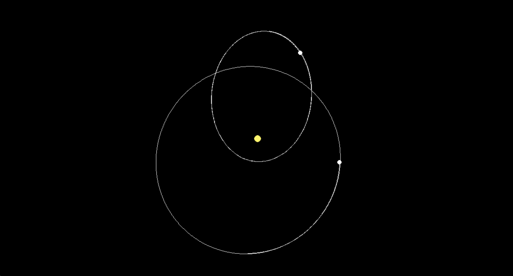
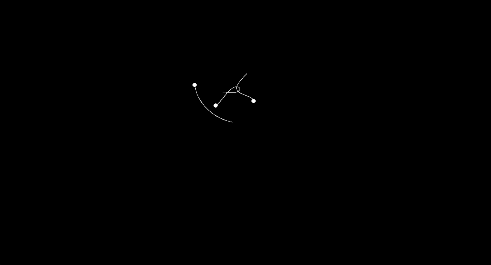

# 3-Body Problem

A real-time N-body gravitational simulation built with Python and Pygame.

## Preview





## Features

- **Newtonian gravity** — Uses \(G = 6.6743 \times 10^{-11}\)
- **Interactive bodies** — Click and drag to create masses with an initial velocity
- **Fixed “sun”** — One immovable central mass (yellow) acts as an anchor (can be removed with backspace) and other bodies (white) orbit and interact
- **Orbit tracers** — Toggle trail lines to visualize paths (press **T**)
- **Adjustable timestep** — Use **←** / **→** to slow down or speed up the simulation
- **Undo** — **Backspace** removes the last body you added

## Requirements

- Python 3.x
- [Pygame](https://www.pygame.org/) 2.6.1

## Setup

```bash
pip install -r requirements.txt
```

## Run

```bash
python main.py
```

## Controls

| Key / Action        | Effect                          |
|--------------------|----------------------------------|
| **Click + drag**   | Add a new mass; release sets velocity |
| **←** / **→**      | Decrease / increase timestep    |
| **T**              | Toggle orbit tracers on/off     |
| **Backspace**      | Remove the last added mass      |
| **Close window**   | Quit                            |